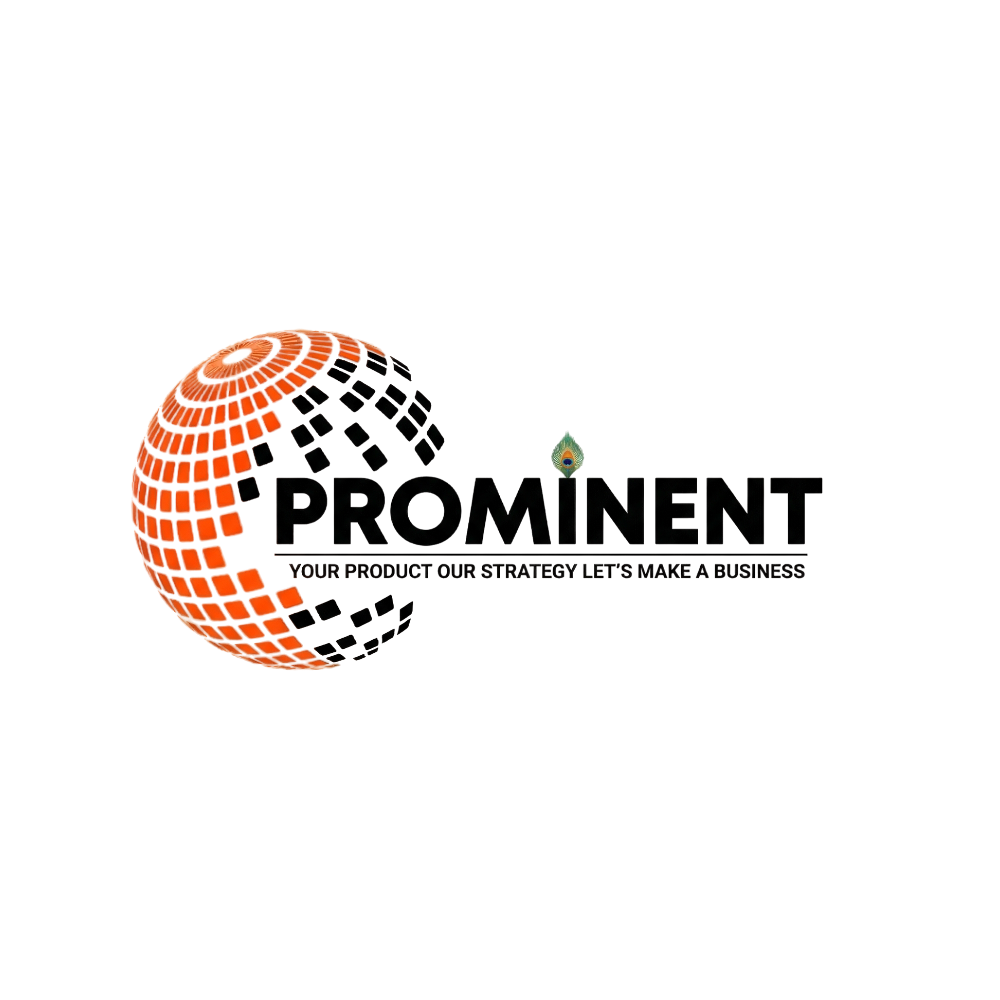

  

  <h1>🚀 Prominent Digitech Global</h1>

  
<strong><em>Your Product, Our Strategy. Let's Make a Business.</em></strong>

  

    
    
    
    
    
  

  

    <a href="#about-us">About</a> •
    <a href="#our-services">Services</a> •
    <a href="#architecture--features">Architecture</a> •
    <a href="#uiux-design-system">Design System</a> •
    <a href="#contact-information">Contact</a>
  

---

## 🌍 About Us

**Prominent Digitech Global** is a premier, full-service digital marketing agency headquartered in Indore, India, with expanding operations globally including California, USA, and Jabalpur, India. 

We specialize in crafting data-driven strategies and building robust digital systems that position brands ahead of the curve. Our mission is to transform your digital presence into a powerful engine for sustainable growth. 

This repository contains the source code for our **official corporate web platform**, designed to deliver a blazing-fast, immersive, and premium user experience.

---

## 🔥 Architecture & Features

The platform is architected for maximum performance, SEO dominance, and visual excellence.

*   ⚡ **Static Site Generation (SSG)**: Fully compiled into static HTML/CSS/JS for instant load times globally via Edge delivery.
*   🎨 **Immersive Preloader**: A custom-engineered "Enter & Unblur" sequence with a staggered gravity-drop transition.
*   🧭 **Dynamic Mega Menu**: A full-width, categorized, hover-activated desktop navigation system housing over 30 distinct service offerings.
*   📱 **Flawless Mobile Experience**: Fully responsive layouts featuring touch-friendly accordion menus, dynamic padding adjustments, and responsive CSS clipping paths.
*   🏎️ **Performance First**: Implements `prefers-reduced-motion` for hardware-limited devices, eliminating unnecessary GPU composition layers on lower-end hardware.
*   📐 **Modern Asymmetry**: Signature diagonal section dividers created using advanced CSS `clip-path` techniques, seamlessly transitioning between brand colors.

---

## 💼 Core Service Ecosystem

We offer a comprehensive suite of digital solutions, meticulously categorized for our clients:

### 💻 Development & IT Solutions
*   Custom Web Development
*   Complete IT Infrastructure Solutions
*   Website Designing, Maintenance, and Support

### 📈 Brand Development
*   Branding Strategy and Promotion
*   End-to-end Brand Management

### 📊 Digital & Performance Marketing
*   **Search Engine Optimization (SEO)**: On-Page, Off-Page, Technical, E-Commerce, and International SEO.
*   **Search Engine Marketing (SEM) & SMM/SMO**
*   **Targeted Ads Marketing**: Google Ads, YouTube Ads, Facebook Ads, Instagram Ads, and precise Lead Generation.
*   **Content & Affiliate Marketing**
*   **Direct Outreach**: WhatsApp and Email Marketing campaigns.

### 🛒 E-Commerce Excellence
*   E-Commerce Product Listing and Optimization
*   Dedicated E-Commerce Advertising
*   24/7 E-Commerce Chat & Voice Support

### 📝 Strategic Listing & Support
*   Tender Listing & Product Listing Services
*   Comprehensive Voice and Chat Support protocols.

---

## 🗺️ Platform Topography

The digital platform is structured into key conversion-focused routes:

| Route | Purpose & Content |
| :--- | :--- |
| `🏠 /` | **The Hub:** High-impact hero section, core service grid, 24/7 operational metrics, industry focus areas, and client testimonials. |
| `📖 /about` | **Our Story:** Deep dive into our mission, vision, core values, and the leadership team driving the agency. |
| `⚡ /services` | **The Engine:** Detailed, process-oriented breakdowns of our SEO, Social Media, Full-Stack Web Development, and PPC methodologies. |
| `🏭 /industries` | **Our Reach:** Tailored digital marketing solutions mapped to specific sectors (Healthcare, Real Estate, Finance, Auto, tech, etc.). |
| `🏆 /case-study` | **The Proof:** A dynamically filterable portfolio showcasing successfully executed campaigns and digital transformations. |
| `📞 /contact` | **The Gateway:** Direct communication channels, interactive forms, and global office locations. |

---

## 🎨 UI/UX Design System

The visual identity is built on a custom aesthetic that balances high-energy brand colors with premium, creamy neutral tones to avoid the sterility of pure white.

### Typography
*   **Headings**: Robust, modern sans-serif.
*   **Body**: Highly legible, breathable variable fonts.

### Color Palette

| Token | Hex Value | Application |
| :--- | :--- | :--- |
| 🔴 **Primary Orange** | `#FF5400` | Primary CTA buttons, key highlights, active states. |
| 🟠 **Hover Orange** | `#E64A00` | Interactive hover states, secondary accents. |
| ⚪ **Cream Background**| `#F6F1EB` | Primary page base, establishing a warm, premium feel. |
| 🪙 **Soft Surface** | `#FFF8F2` | Alternating section backgrounds for depth. |
| ⬛ **Charcoal Text** | `#121212` | High-contrast heading typography. |
| 🌑 **Muted Text** | `#3A3A3A` | Highly readable body copy. |

---

## 📬 Contact Information

Looking to scale your business? Let's talk strategy.

*   📧 **Email Inquiries:** [prominentdigitechsolution@gmail.com](mailto:prominentdigitechsolution@gmail.com)
*   📞 **Direct Line:** +91 83490-94764
*   💬 **WhatsApp Business:** [Connect Instantly](https://wa.me/918349094764)

### Global Offices
*   📍 **Head Office:** 507 MR-5, Mahalaxmi Nagar, Indore, Madhya Pradesh, India
*   📍 **Branch Office:** Jabalpur, India
*   📍 **Branch Office:** California, USA

---

  
<em>© 2025 Prominent Digitech Global. Proprietary corporate software. All rights reserved.</em>

